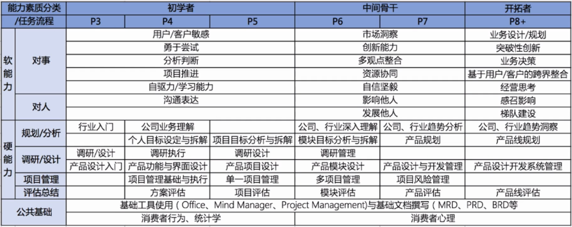

# 第一节 产品经理成长体系

## 一、什么是互联网产品经理

关于互联网产品经理，可以从两个角度来讲：

### 用通俗话来讲，就是做App的。

### 用规范化话来讲

* 产品的**设计与规划**
* 研究**竞争对手**以及竞品情况
* 产品设计，优化以及**需求文档输出**
* 为产品提出商业合作的**建议和方向**
* 保障产品**开发进度**和产出

## 二、互联网产品经理的能力要求？

要做一个称职的符合用人单位要求的产品经理，可能有下面的要求。

* 学历（骗你的啦，有能力的人根本不需要学历证明自己）
* 有相关产品设计经验（没有，那就让自己变得有！）
* 熟悉IOS和Android交互规范
* 产品设计以及规划和创新
* 需求文档撰写
* 数据分析
* 抗压能力强
* 总得来说，工作内容很杂，没有特定的学习范畴。

## 三、产品经理的成长途径

在完整的产品经理成长路线中，每个阶段有不同的工作要求。

* P0 - P3：基础能力。把工作完成就👌，把基础技能巩固好。
* P3 - P5:   项目把控。把控项目进度进展以及项目落地。
* P5 - PN:  团队效能更高。偏向管理团队的职能，管理团队前进方向。
* PN  - ∞: 专门提供干货，已经不在局限某个领域，更偏向于公司前进方向的把控，但对P3以内的产品经理是毒药。

## 四、产品经理的学习内容概览

总的来说，学习内容很杂也很乱，但是万变不离其宗，最重要的还是“用户需求”，所以一定要把需求分析放在工作的首位。

## 五、产品经理成长的困惑

在成为产品经理的路上，我们会遇到哪些困惑，该怎么解开？

1. 产品经理不需要学编程，不要学历，不需要专业背景，不要求经验，只需要有一腔热血，就能做好？

   答案是不可取的，产品经理是一个对综合能力要求较高的岗位，但上面所讲的内容都是不可取的。

2. 天天写文档，画原型，回家继续看知乎的内容学习成长，这样成长可否？

   这样的成长也是不可取的，单纯的做着重复的工作对成长是没有用的，可以按照大公司的产品经理产品能力标准要提升自己，才是正确的成长方式。

## 六、产品经理的成长体系

每个公司的能力要求和知识框架都有不同判断标准和分类标准，下面以腾讯和产品的知识成长能力标准和素质分类标准作为范例，可以根据自己的能力层级来逐渐提升自己。

## 七、产品经历的学习模型

从做事的角度来讲，我们需要培养什么样的能力，可以从下面的学习模型来进行规划。

## 八、产品经理课程结构

下面是我们要当产品经理的课程结构图，先看整体的知识结构，再根据某个结构进行知识点学习，再按照某个知识点中自己的等级选择性地去增强，达到逐步学习，从质变到量变的过程。

## 九、学习路径的总结

想要学习产品经理关键就是要积累，所以一定要学基础，但是也要不停地去练，再用理论来指导实践，这样才能学的更快更稳。

## 十、课题思考作业 -  在过去的几年经历了哪些成长和收获

关于这个，我其实想说，从毕业到现在，我收获最大的就是在前端技术的增长以及人事物的处理上面，也知道了要有很多的付出，才能有一定的收获这个道理。从大二就开始学习编程，一直很喜欢但是都没有很认真地去学习，到了快毕业的时候，大家都去找实习了，而我没有，我只是在家苦练前端的技术，等毕业的时候，我找到了我人生第一份正式工作，没错，就是前端工程师。所以我才知道了，如果不下一番苦工，我可能就是毕业就失业的那群人，所以我知道，如果想要得到某样东西，你就必须付出相应的劳动或者精力。

