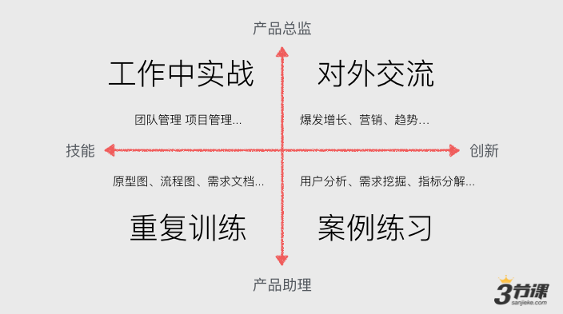
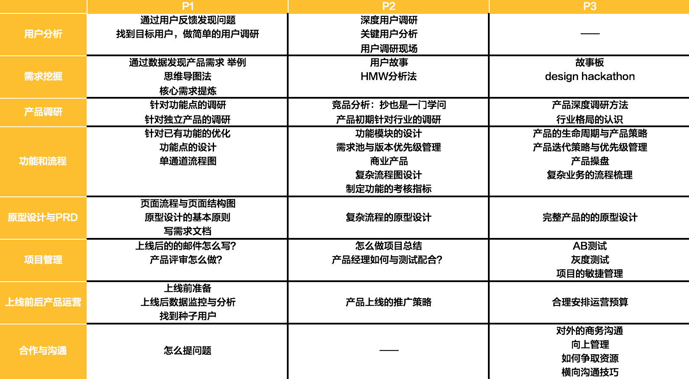

# 第一章 课程寄语

## 一、入门需要注意的点

1. 产品经理不可以被培训，但可以被培养，只要把工作所需要的基础夯实，学习效率也能非常高，能在实际工作中快速成长。
2. 学习不要指望只学习知识，要学会融会贯通才是硬道理。学习是一个长期的过程，需要通过在这个长期的过程中不停联系，结果是后置的。比如说工作中遇到了数据分析的难点，但是通过自己的学习和梳理，重新梳理和整理数据，才能对工作的数据处理游刃有余。
3. 学习没有捷径，学习本身就是痛苦的过程，但是可以通过提升学习的效率来减轻痛苦。

## 二、提升学习效率的途径

有时候可能会感到迷茫，学习很痛苦，但是怎么才能提高学习的效率来减轻痛苦，可以通过下图对产品经理的能力和学习进阶的了解过程。

## 三、产品经理学习框架图

仅仅是提高学习效率是一方面，但是要知道自己具体学什么也是非常重要的一部分，下面提供一个学习框架图，希望大家根据自己的情况有选择的增强自己薄弱的部分，或者可以从上往下学习，将自身的知识框架夯实了，再有意识地去增加自身薄弱部分。

## 四、本章小结

初步了解了学习产品经理应该要注意的点，同时了解提升学习效率的途径以及产品经理的学习框架，开始对产品经理工作所需能力有初步认识。

